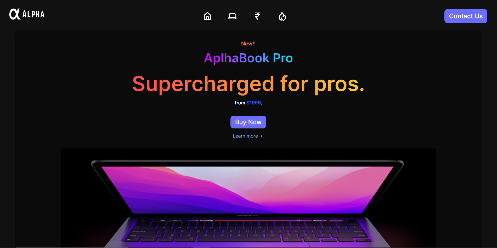

# UI-UX Challenge 2022 by TECHNOVANZA

### Project Task
**To design a website for showcasing any electronic gadget like Smartphone , Tablet , Smart Watch PC or Laptop etc.**

[Live Demo URL](https://developerstuffs.com)

### Languages Used
* HTML5
* CSS3
* Java Script

### UI Resources used
* Images - (Google Images)
* SVG Icons - (Iconscout/unicons)
* Fonts- (Google fonts)
* Logo Design (Canva.com)

